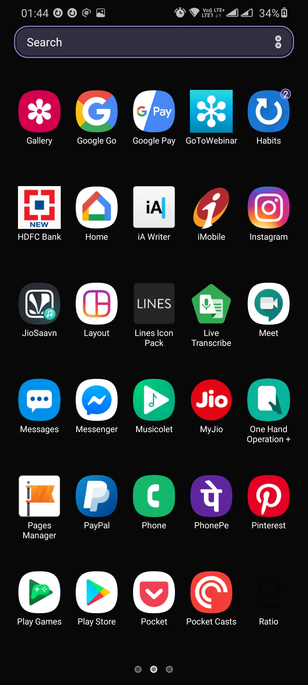
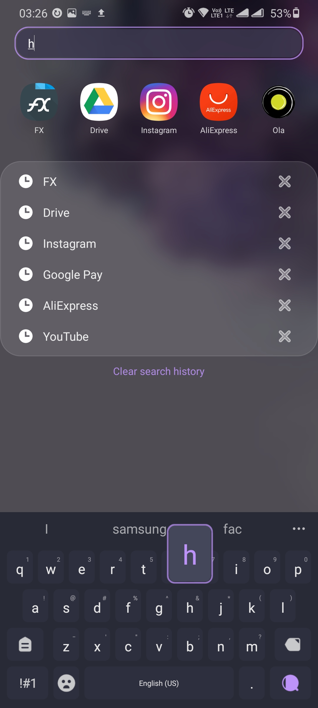
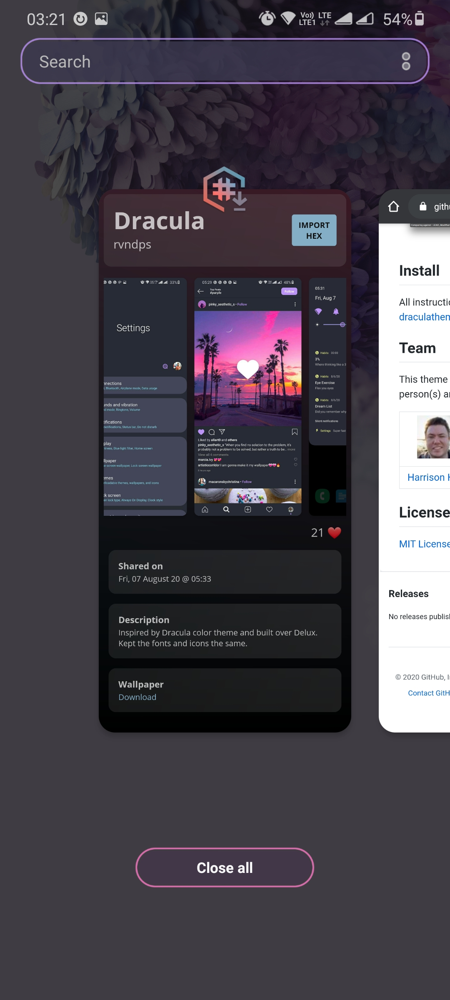
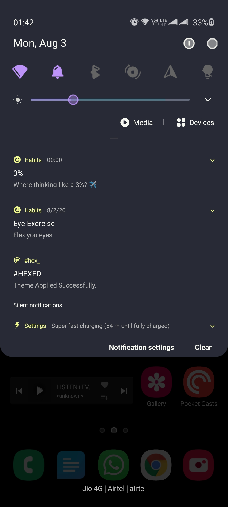
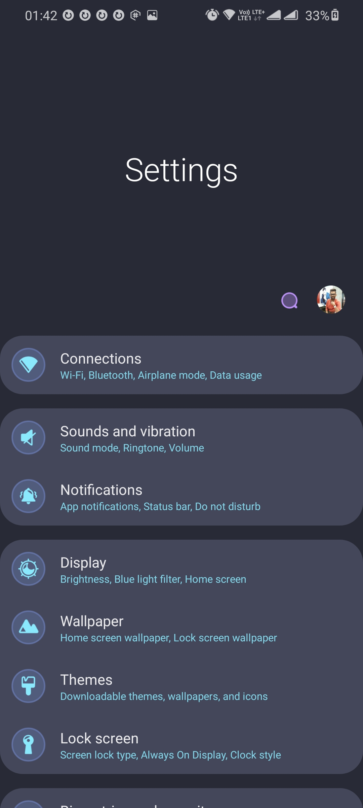
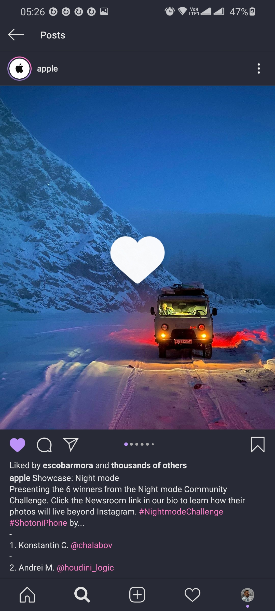
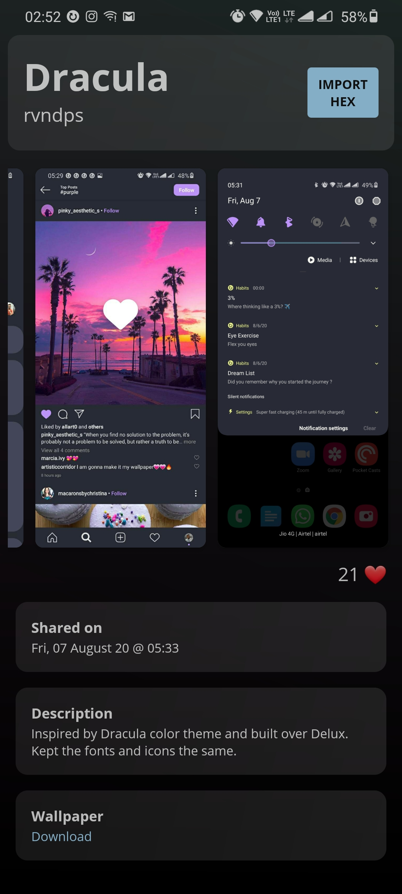

# Dracula for Hex Installer OneUI/OneUI 2.0

> A dark theme for [Hex Installer OneUI/OneUI 2.0](https://play.google.com/store/apps/details?id=project.vivid.hex.bodhi&hl=en_IN) for samsung android.

## Install

All instructions can be found at [draculatheme.com/x](https://draculatheme.com/x).

## Team

This theme is maintained by the following person(s) and a bunch of [awesome contributors](https://github.com/dracula/template/graphs/contributors).

 | 
--- | ---
[Aravind P S](https://github.com/aravindps) | [Zeno Rocha](https://github.com/zenorocha)

## License

[MIT License](./LICENSE)
